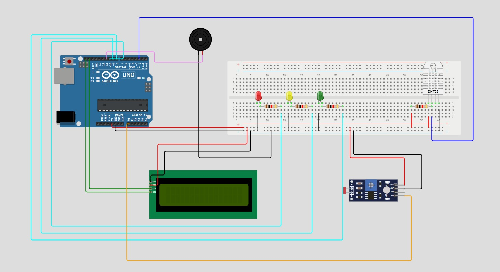

# Vinheria Agnello - Monitoramento de Ambiente para Armazenamento de Vinhos

## Sobre o Projeto

Esse projeto foi desenvolvido com o objetivo de criar um sistema inteligente de monitoramento para ambientes de armazenamento de vinhos.

O sistema realiza o monitoramento da luminosidade, temperatura e umidade do ambiente, garantindo condições adequadas para preservar a qualidade dos vinhos armazenados.

A partir das informações coletadas pelos sensores, o Arduino analisa os dados e ativa alertas visuais e sonoros quando alguma condição estiver fora da faixa ideal.

---

# Objetivo

Os vinhos são extremamente sensíveis às condições do ambiente. Excesso de luz, temperaturas inadequadas e umidade desregulada podem comprometer sua conservação e alterar suas características.

Pensando nisso, o projeto foi desenvolvido para automatizar o monitoramento do ambiente da vinheria, auxiliando no controle e na preservação das garrafas.

---

# Funcionalidades

- Monitoramento da luminosidade do ambiente
- Monitoramento da temperatura
- Monitoramento da umidade
- Exibição das informações em um display LCD
- Alertas visuais utilizando LEDs
- Alertas sonoros utilizando buzzer
- Cálculo da média de 5 leituras dos sensores
- Atualização automática dos dados a cada 5 segundos

---

# Funcionamento do Sistema

# Estrutura do Projeto



## Luminosidade

- Ambiente escuro:
  - LED verde aceso

- Ambiente em meia luz:
  - LED amarelo aceso
  - Display mostra "MEIA LUZ"

- Ambiente muito claro:
  - LED vermelho aceso
  - Buzzer ativado
  - Display mostra "MUITO CLARO"

---

## Temperatura

### Faixa ideal:
- Entre 10°C e 15°C

### Situações:

- Temperatura OK:
  - Display informa "Temp. OK"

- Temperatura alta:
  - LED amarelo aceso
  - Buzzer ativado
  - Display informa "Temp. ALTA"

- Temperatura baixa:
  - LED amarelo aceso
  - Buzzer ativado
  - Display informa "Temp. BAIXA"

---

## Umidade

### Faixa ideal:
- Entre 50% e 70%

### Situações:

- Umidade OK:
  - Display informa "Umidade OK"

- Umidade alta:
  - LED vermelho aceso
  - Buzzer ativado
  - Display informa "Umidade ALTA"

- Umidade baixa:
  - LED vermelho aceso
  - Buzzer ativado
  - Display informa "Umidade BAIXA"

---

# Estrutura do Projeto

```text
vinheria-inteligente/
│
├── sistemaMonitoramento.ino
├── diagram.json
├── libraries.txt
├── README.md
└── imagem-circuito.jpeg
```

---

# Componentes Utilizados

## Hardware

- 1 Arduino Uno
- 1 Sensor DHT11/DHT22
- 1 Sensor LDR (fotoresistor)
- 1 Display LCD I2C 16x2
- 3 LEDs:
  - Verde
  - Amarelo
  - Vermelho
- 1 Buzzer Piezo
- Resistores
- Cabos jumper
- Protoboard

---

## Software

- Arduino IDE
- Wokwi

---

# Bibliotecas Utilizadas

```cpp
#include <DHT.h>
#include <LiquidCrystal_I2C.h>
```

---

# Como Executar o Projeto

## No Wokwi

1. Abra o link da simulação
2. Clique em "Start Simulation"
3. Altere os valores do sensor DHT11 e do LDR
4. Observe os LEDs, o buzzer e o display LCD funcionando em tempo real

---

## Na Arduino IDE

1. Clone o repositório:

```bash
git clone 
```

2. Abra o arquivo `.ino`

3. Instale as bibliotecas:
   - DHT Sensor Library
   - LiquidCrystal I2C

4. Faça upload do código para o Arduino

---

# Vídeo Explicativo

Link do vídeo demonstrando o funcionamento do sistema:

https://youtu.be/FIgd5O2-fYU?si=Gkyp2ifAxJ3fy4Ra

---

# Simulação do Projeto

Link da simulação no Wokwi:

https://wokwi.com/projects/464680551292186625

---

# Integrantes

- Amanda Silva
- Beatriz Mantovani
- Gustavo Ducatti
- Laura Sampaio
